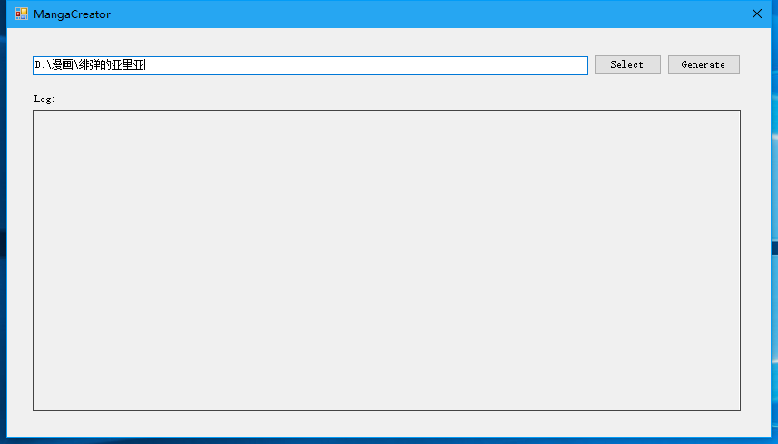
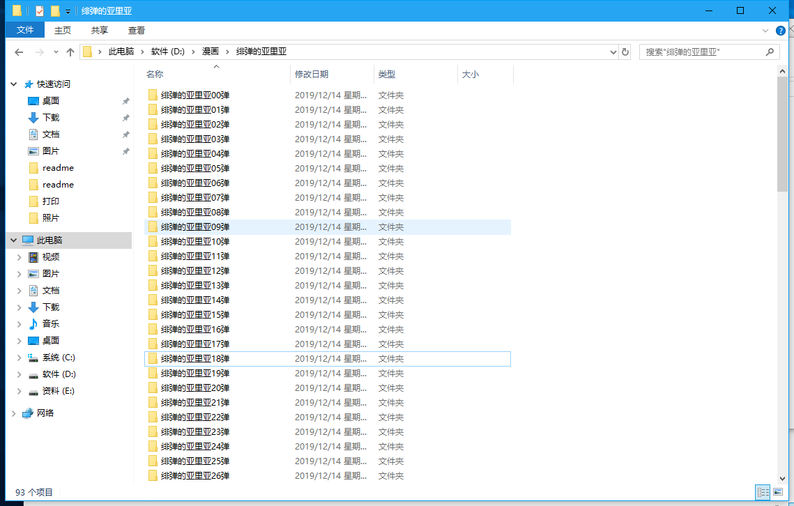
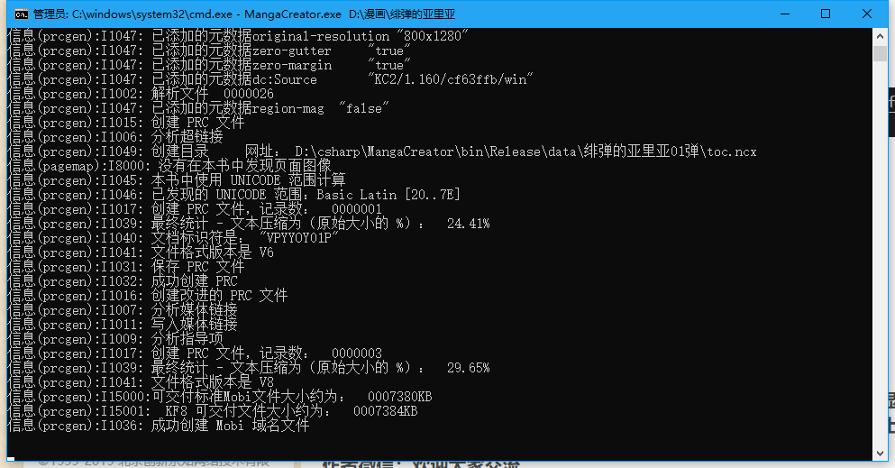
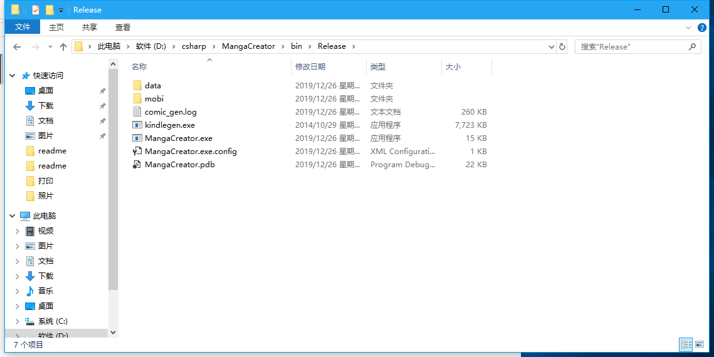
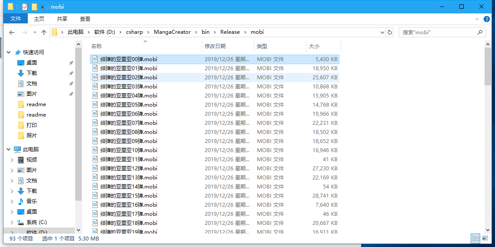
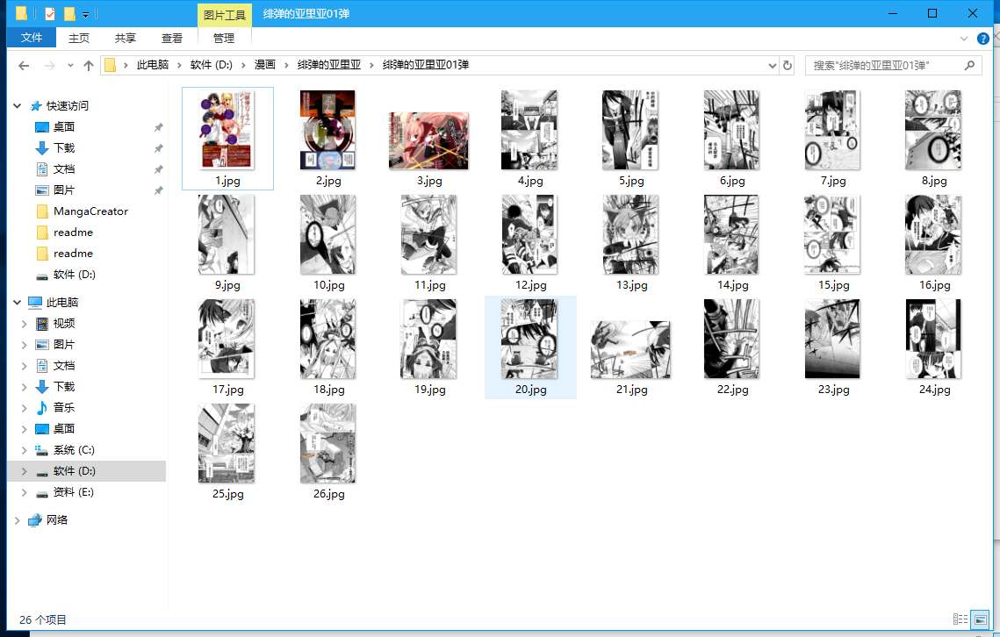
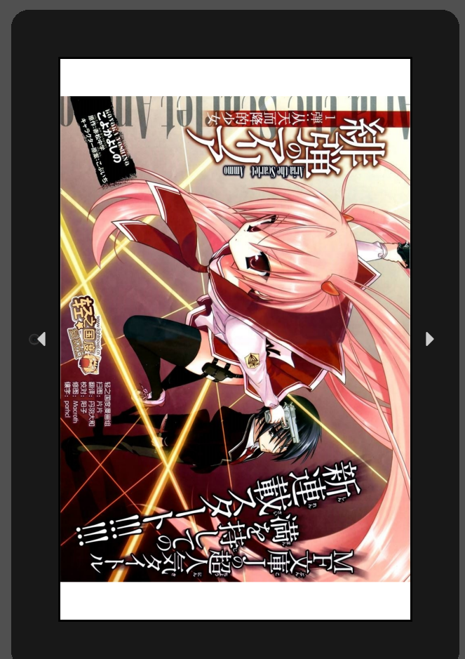

# MangaCreator

## 介绍

用C#实现的基于kindlegen.exe的漫画生成器，全自动生成mobi，根据文件夹命名，方便快捷。

.NET Framework 4.5

**注：使用本程序需要有kindlegen.exe**

## 特性

- 可视化界面
- 可将漫画图片批量生成mobi文件
- 自动搜索目录下所有话的文件夹，并生成mobi，无需手动一个个指定
- 可自动将横着的图片旋转90度
- 自动缩放图片为800x1200
- 可将多个文件夹合成一话

## 工作原理

- 将给定的漫画文件夹中的图片复制到MangaCreator.exe所在目录中的“data/漫画文件夹名/html/scaled-images”中，同时生成相应的html文件、content.opf文件以及toc.ncx文件。
- 调用MangaCreator.exe所在目录中的kindlegen.exe生成mobi，生成的mobi存放在所在目录的mobi文件夹内

## 注意事宜

- 默认设备尺寸为800x1280，我的设备是Kindle Paperwhite4，看起来没有问题
- 漫画图片名字中需要包含当前页码的数字
- 每话的文件夹名称需要包含当前话数或册数的数字

## 使用说明

用命令行运行程序MangaCreator.exe，输入需要转换的漫画文件夹即可，如下所示

运行程序

该总目录下包含很多话的文件夹（也可以指定这里面的某一个目录单独生成一话）

程序运行中

生成data和mobi文件夹，data目录下生成的临时文件在生成后自动删除。

生成的mobi文件

这一话中第三页是横过来的，生成后的mobi则是正常的

